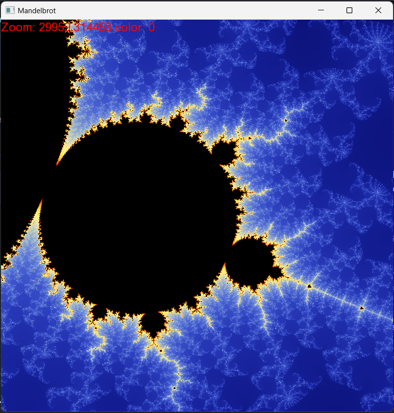

# GLSL Mandelbrot Set

Simple Mandelbrot set visualization using SFML and GLSL. Using a fragment shader to calculate the Mandelbrot set allows us to leverage the GPU for high performance rendering. However this prevents us from zooming in indefinitely, as the precision of the floating point numbers used in the shader is limited.

## Usage

Spacebar resets the view, left mouse click to center the view, scroll to zoom in and out.

## Screenshot

